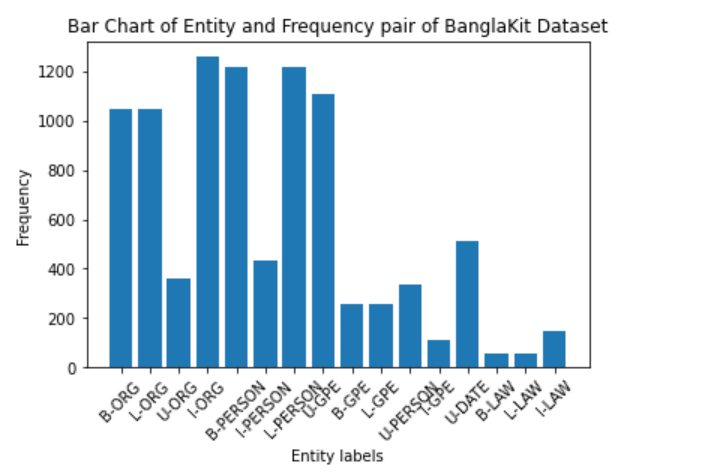
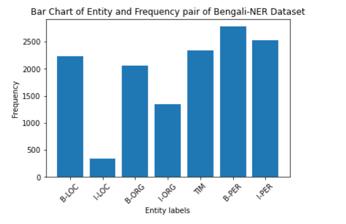
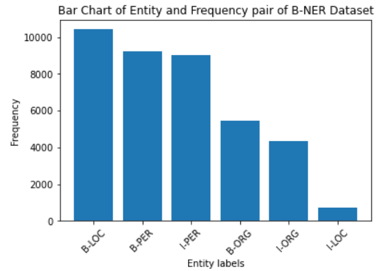
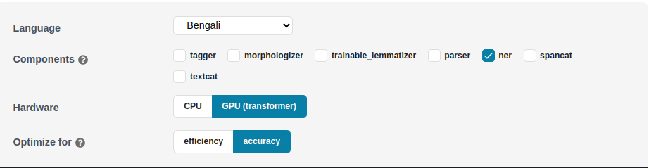

# Bangla NER Experiments with SpaCy

This repository contains code and information related to conducting experiments on Named Entity Recognition (NER) for Bangla language using SpaCy. The goal of these experiments is to develop and evaluate NER models specifically tailored for extracting person entities from Bangla text.

We performed 10 different experiment on transition based and transformer based model using spacy. Finaly we achieved best result `F1 score ~.85`

## Dataset

Data has been collected from THREE different sources.

1. [Bengali-NER](https://github.com/Rifat1493/Bengali-NER/tree/master/annotated%20data)
2. [banglakit](https://raw.githubusercontent.com/banglakit/bengali-ner-data/master/main.jsonl)
3. [B-NER](https://www.kaggle.com/datasets/mdzahidulhaquealvi/b-ner?select=dataset_r.csv)

### Dependency
```bash
pip install spacy
pip install transformers
pip install spacy-transformers  
```

### Training and Evaluvation Environment

```
Google Colab GPU
Kggle GPU
```

## Data Processing

The dataset consists of labeled Bangla text samples, where each sample is annotated with person entity labels.

<table>
  <tr>
    <td valign="top"></td>
    <td valign="top"></td>
    <td valign="top"></td>
  </tr>
</table>

To create a focused dataset specifically for person entity extraction, the following steps were performed:

1. <span style="color:orange;">Data Cleaning</span>: The dataset was cleaned to remove any irrelevant or noisy samples that could affect the quality of the training data. This step involved removing sentences with no entity labels except for person.

2. <span style="color:orange;">Entity Label Filtering</span>: The dataset was filtered to retain only the person entity labels while discarding other entity types such as location, organization, etc. This filtering step ensured that the final dataset exclusively contained person entities for the NER task.

3. <span style="color:orange;">Data Size</span>: After the above preprocessing steps, the dataset size was reduced to a more manageable number of sentences that specifically contained person entity labels.

After processing total number of data
- Considering only person entity tags [8667]()
- Considering all type of entity tags [18109]()

To run preprocessing steps execute following command
```
python scripts/data_processing.py data/all_data.txt data/B-NER.txt data/main.jsonl
```
### Arguments

The script accepts the following command-line arguments:

- <span style="color:orange;">iob_data_path</span>: Path to the IOB data file. which is banglakit ner dataset.
- <span style="color:orange;">iob_data_path</span>: Path to the text data file. which is B-NER dataset.
- <span style="color:orange;">jsonl_data_path</span>: Path to the JSONL data file. which is bengali-ner dataset.

Ensure that you provide the correct file paths as arguments when running the script.

This script allows you to merge two data files, combining their data into a single BLIOU JSON file. The merged data can be used for further analysis or processing.


we are demonstrating token-level entity annotation using the BILUO tagging scheme to describe the entity boundaries.


## Training Procedure

1. <span style="color:orange;">Prepare your training data</span>: Create a JSON or CSV file containing your annotated training examples. Each example should include the text and the annotated entities. After running above preprocessing steps we will get expected json format file.
2. <span style="color:orange;">Dataset split</span>: in 80% training and 10% testing and 10% validation.
3. <span style="color:orange;">Convert the training data to spaCy format</span>: Use the convert command to convert your training data to spaCy's binary format. For example:
```
python -m spacy convert training_data.json ./output -t json
```
This command will convert the training_data.json file to spaCy format and save it in the output directory. <br>
4. <span style="color:orange;">Create a new configuration file</span>: Create a new configuration file (base_config.cfg) where you can define your training settings and pipeline components. Refer to spaCy's [documentation](https://spacy.io/usage/training) for more details on configuring your model.



5. Create training config file from base config using below command
```
!python -m spacy init fill-config base_config.cfg config.cfg
```
6. <span style="color:orange;">Train the model</span>: Use the train command to train the model. For example:
```
!python -m spacy train config.cfg --output ./output --paths.train data/train.spacy --paths.dev data/val.spacy --gpu-id 0
```

7. <span style="color:orange;">Evaluate the model</span>: Use the evaluate command to evaluate the model's performance. For example:
```
!python -m spacy evaluate output/model-best data/test.spacy --gpu-id 0
```

## Training and Testing in Kaggle

The dataset and pretrained model with traning and testing script is shared in kaggle.

Follow this [kaggle link](https://www.kaggle.com/code/aminulpalash/spacy-transformer-train-test/notebook#Testing-with-input-Text-with-only-Person-entity-trained-model) to run and test.


## Interence Spacy Transformer model

```
import spacy_transformers
import spacy

nlp = spacy.load("/kaggle/input/bner-trained-modesl/output/model-best")

text_list = [
    "বিএনপি নেতাদের সবচেয়ে বড় দুর্বলতা তাঁরা রাজনৈতিক কর্মী আর সন্ত্রাসী গুলিয়ে ফেলেছেন বলে মন্তব্য করেছেন তথ্যমন্ত্রী হাছান মাহমুদ",
    "আব্দুর রহিম নামের কাস্টমারকে একশ টাকা বাকি দিলাম",
    "ড. হাছান বলেন, দেশ যখন জননেত্রী শেখ হাসিনার নেতৃত্বে এগিয়ে যাচ্ছে, তখন দেশি-বিদেশি নানা ষড়যন্ত্র শুরু হয়েছে।"
    ]
for text in text_list:
    doc = nlp(text)

    print(f"Input Text: {text}")
    for entity in doc.ents:
        print(f"( {entity.text}, {entity.label_})")
    print("----------------------------------------------------")

## outputs

Input Text: বিএনপি নেতাদের সবচেয়ে বড় দুর্বলতা তাঁরা রাজনৈতিক কর্মী আর সন্ত্রাসী গুলিয়ে ফেলেছেন বলে মন্তব্য করেছেন তথ্যমন্ত্রী হাছান মাহমুদ
( হাছান মাহমুদ, PER)
----------------------------------------------------
Input Text: আব্দুর রহিম নামের কাস্টমারকে একশ টাকা বাকি দিলাম
( আব্দুর রহিম, PER)
----------------------------------------------------
Input Text: ড. হাছান বলেন, দেশ যখন জননেত্রী শেখ হাসিনার নেতৃত্বে এগিয়ে যাচ্ছে, তখন দেশি-বিদেশি নানা ষড়যন্ত্র শুরু হয়েছে।
( ড. হাছান, PER)
( শেখ হাসিনার, PER)
----------------------------------------------------

```


## Experiment Details

Please Follow this [link](./experiment/) to see details experiments methods and comparative results.
