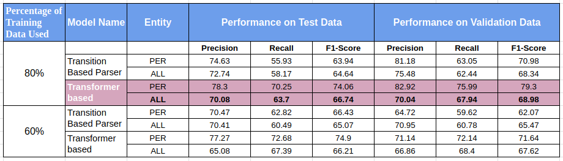

# Bangla NER Experiments with SpaCy

This repository contains code and information related to conducting experiments on Named Entity Recognition (NER) for Bangla language using SpaCy. The goal of these experiments is to develop and evaluate NER models specifically tailored for extracting person entities from Bangla text.

## Dataset

Data has been collected from two different sources.

1. [Bengali-NER](https://github.com/Rifat1493/Bengali-NER/tree/master/annotated%20data)
2. [banglakit](https://raw.githubusercontent.com/banglakit/bengali-ner-data/master/main.jsonl)
3. [B-NER](https://www.kaggle.com/datasets/mdzahidulhaquealvi/b-ner?select=dataset_r.csv)

### Dependency
```bash
pip install spacy
pip install transformers
pip install spacy-transformers  
```

## Data Processing

The dataset consists of labeled Bangla text samples, where each sample is annotated with person entity labels.

<table>
  <tr>
    <td valign="top"></td>
    <td valign="top"></td>
  </tr>
</table>

To create a focused dataset specifically for person entity extraction, the following steps were performed:

1. <span style="color:orange;">Data Cleaning</span>: The dataset was cleaned to remove any irrelevant or noisy samples that could affect the quality of the training data. This step involved removing sentences with no entity labels except for person.

2. <span style="color:orange;">Entity Label Filtering</span>: The dataset was filtered to retain only the person entity labels while discarding other entity types such as location, organization, etc. This filtering step ensured that the final dataset exclusively contained person entities for the NER task.

3. <span style="color:orange;">Data Size</span>: After the above preprocessing steps, the dataset size was reduced to a more manageable number of sentences that specifically contained person entity labels.

After processing total number of data
- Considering only person entity tag [2895]()
- Considering all type of entity tags [6685]()

To run preprocessing steps execute following command
```
python scripts/data_processing.py data/all_data.txt data/main.jsonl
```
### Arguments

The script accepts the following command-line arguments:

- <span style="color:orange;">iob_data_path</span>: Path to the IOB data file. which is banglakit ner dataset.
- <span style="color:orange;">jsonl_data_path</span>: Path to the JSONL data file. which is bengali-ner dataset.

Ensure that you provide the correct file paths as arguments when running the script.

This script allows you to merge two data files, combining their data into a single BLIOU JSON file. The merged data can be used for further analysis or processing.


we are demonstrating token-level entity annotation using the BILUO tagging scheme to describe the entity boundaries.


## Experiment Details


- <span style="color:orange;">Objective</span>: Train and evaluate Spacy NER models for person entity extraction from Bangla text.

- <span style="color:orange;">Approaches</span>: Transition-based model and Transformer-based model.

- <span style="color:orange;">Datasets</span>: Two types of datasets were used for each model:

  1. All Entity Types (including person, organization, location, etc. annotations). Total datset amount is 6685
  2. Only Person Entities (annotations specifically for person entities). Total dataset amount is 2895


- <span style="color:orange;">Dataset Splitting</span>: The datasets were split into the following subsets:
  ```
  Training set: 80% of the data.
  Validation set: 10% of the data.
  Test set: 10% of the data.
  ```
  ```
  Training set: 60% of the data.
  Validation set: 20% of the data.
  Test set: 20% of the data.
  ```
  
- <span style="color:orange;">Model Training</span>: Each model was trained using the respective datasets.

- <span style="color:orange;">Evaluation</span>: Separate test datasets were used to evaluate the performance of each model.

- <span style="color:orange;">Results</span>:

This table shows the results of training NER model consideing only person entity dataset. We have achieved better accuracy on test dataset on transformer based model with training data spliting with 80%. 

</td>

This table shows the results of training NER model consideing all type of entity dataset. We have achieved better accuracy on test dataset on transformer based model with training data spliting with 80%. 

</td>


