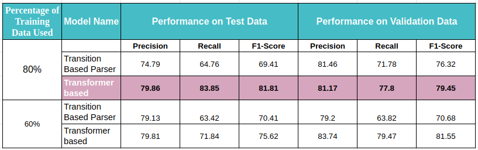
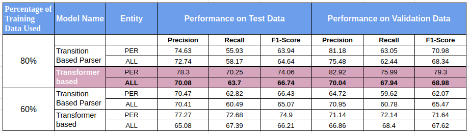
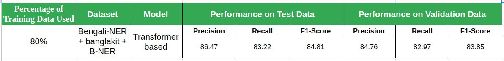
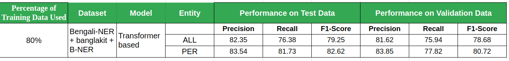

## Experiment Process

- <span style="color:orange;">Objective</span>: Train and evaluate Spacy NER models for person entity extraction from Bangla text.

- <span style="color:orange;">Approaches</span>: Transition-based model and Transformer-based model.

- <span style="color:orange;">Datasets</span>: Two and three types of datasets combinely were used for each model:
> - Two dataset (Benglakit , bangla-ner)
  1. All Entity Types (including person, organization, location, etc. annotations). Total dataset amount is 6685
  2. Only Person Entities (annotations specifically for person entities). Total dataset amount is 2895

> - Three dataset (B-NER, Benglai-ner, Banglakit)
   1. Only Person Entities (annotations specifically for person entities). Total dataset amount is 8667
   2. All Entity Types (including person, organization, location, etc. annotations). Total dataset amount is 18109


- <span style="color:orange;">Dataset Splitting</span>: The datasets were split into the following subsets:
  ```
  Training set: 80% of the data.
  Validation set: 10% of the data.
  Test set: 10% of the data.
  ```
  ```
  Training set: 60% of the data.
  Validation set: 20% of the data.
  Test set: 20% of the data.
  ```
  
- <span style="color:orange;">Model Training</span>: Each model was trained using the respective datasets.

- <span style="color:orange;">Evaluation</span>: Separate test datasets were used to evaluate the performance of each model.

- <span style="color:orange;">Results</span>:

This table shows the results of training NER model consideing only person entity dataset. We have achieved better accuracy on test dataset on transformer based model with training data spliting with 80%. 

</td>

This table shows the results of training NER model consideing all type of entity dataset. We have achieved better accuracy on test dataset on transformer based model with training data spliting with 80%. 

</td>

# Performance Improved Results

As from above result, it is clear that, we are getting better results for transformer based model. So we have collected extra NER dataset and combinley trained this model.

- results only person entity considered - 



- Results with all entity considered -



----
----
----

# Visual Results checking with manually collected dataset

----


--------------------------------------------------
## Experiment History

### <span style="color:orange;">Experiment 1 (80% 10% 10%)</span>

Trained only person entity dataset
- <span style="color:green;">Dataset</span>: Banglakit + Bengali-NER
- <span style="color:green;">Total Data</span>: 2895

> - Training set size: 2316
> - Validation set size: 289
> - Test set size: 290

- <span style="color:green;">Model Architecture</span>: TransitionBasedParser

- <span style="color:green;">F1 Score on Test Data</span> : 69.41

----------------------------------------------------------------


### <span style="color:orange;">Experiment 2 (80% 10% 10%)</span>

Trained combining all entity dataset
- <span style="color:green;">Dataset</span>: Banglakit + Bengali-NER
- <span style="color:green;">Total Data</span>: 6685

> - Training set size: 5348
> - Validation set size: 668
> - Test set size: 669

- <span style="color:green;">Model Architecture</span>: TransitionBasedParser
- <span style="color:green;">F1 Score on Test Data</span> : 64.64


----------------------------------------------------------------

### <span style="color:orange;">Experiment 3 (60% 20% 20%)</span>

Trained only person entity dataset
- <span style="color:green;">Dataset</span>: Banglakit + Bengali-NER
- <span style="color:green;">Total Data</span>: 2895

> - Training set size: 2316
> - Validation set size: 289
> - Test set size: 290

- <span style="color:green;">Model Architecture</span>: TransitionBasedParser
- <span style="color:green;">F1 Score on Test Data</span> : 70.41

----------------------------------------------------------------

### <span style="color:orange;">Experiment 4 (60% 20% 20%)</span>

Trained combining all entity dataset

- <span style="color:green;">Dataset</span>: Banglakit + Bengali-NER
- <span style="color:green;">Total Data</span>: 6685

> - Training set size: 5348
> - Validation set size: 668
> - Test set size: 669

- <span style="color:green;">Model Architecture</span>: TransitionBasedParser
- <span style="color:green;">F1 Score on Test Data</span> : 65.07

----------------------------------------------------------------

### <span style="color:orange;">Experiment 5 (80% 10% 10%)</span>

Trained only person entity dataset
- <span style="color:green;">Dataset</span>: Banglakit + Bengali-NER
- <span style="color:green;">Total Data</span>: 2895

> - Training set size: 2316
> - Validation set size: 289
> - Test set size: 290

- <span style="color:green;">Model Architecture</span>: Transformer Based
- <span style="color:green;">F1 Score on Test Data</span> : 81.17

----------------------------------------------------------------


### <span style="color:orange;">Experiment 6 (80% 10% 10%)</span>

Trained combining all entity dataset
- <span style="color:green;">Dataset</span>: Banglakit + Bengali-NER
- <span style="color:green;">Total Data</span>: 6685

> - Training set size: 5348
> - Validation set size: 668
> - Test set size: 669

- <span style="color:green;">Model Architecture</span>: Transformer Based
- <span style="color:green;">F1 Score on Test Data</span> : 66.74

----------------------------------------------------------------

### <span style="color:orange;">Experiment 7 (60% 20% 20%)</span>

Trained only person entity dataset
- <span style="color:green;">Dataset</span>: Banglakit + Bengali-NER
- <span style="color:green;">Total Data</span>: 2895

> - Training set size: 2316
> - Validation set size: 289
> - Test set size: 290

- <span style="color:green;">Model Architecture</span>: Transformer Based
- <span style="color:green;">F1 Score on Test Data</span> : 75.64


----------------------------------------------------------------

### <span style="color:orange;">Experiment 8 (60% 20% 20%)</span>

Trained combining all entity dataset

- <span style="color:green;">Dataset</span>: Banglakit + Bengali-NER
- <span style="color:green;">Total Data</span>: 6685

> - Training set size: 5348
> - Validation set size: 668
> - Test set size: 669

- <span style="color:green;">Model Architecture</span>: Transformer Based
- <span style="color:green;">F1 Score on Test Data</span> : 74.9

----------------------------------------------------------------

### <span style="color:orange;">Experiment 9 (80% 20% 20%)</span>

Trained combining ONLY PERSON entity dataset
- <span style="color:green;">Dataset</span>: Banglakit + Bengali-NER + B-NER
- <span style="color:green;">Total Data</span>: 8667
> - Training set size: 6933
> - Validation set size: 866
> - Test set size: 868

- <span style="color:green;">Model Architecture</span>: Transformer Based
- <span style="color:green;">F1 Score on Test Data</span> : 84.81

----------------------------------------------------------------

### <span style="color:orange;">Experiment 10 (80% 20% 20%)</span>

Trained combining ALL TYPE OF entity dataset

- <span style="color:green;">Dataset</span>: Banglakit + Bengali-NER + B-NER
- <span style="color:green;">Total Data</span>: 18109
> - Training set size: 14487
> - Validation set size: 1810
> - Test set size: 1812

- <span style="color:green;">Model Architecture</span>: Transformer Based
- <span style="color:green;">F1 Score on Test Data</span> : 82.62

----------------------------------------------------------------


